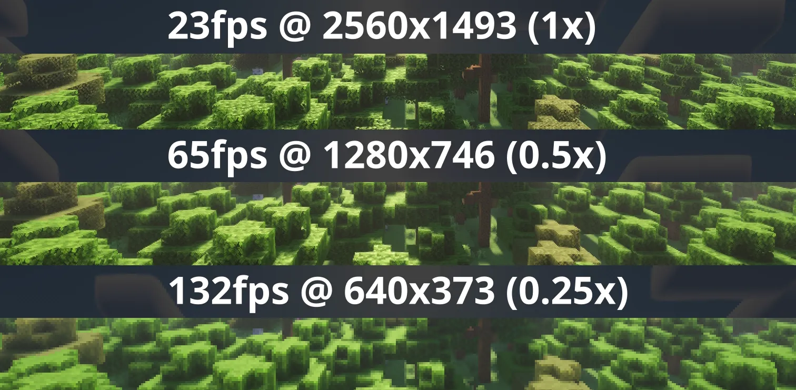
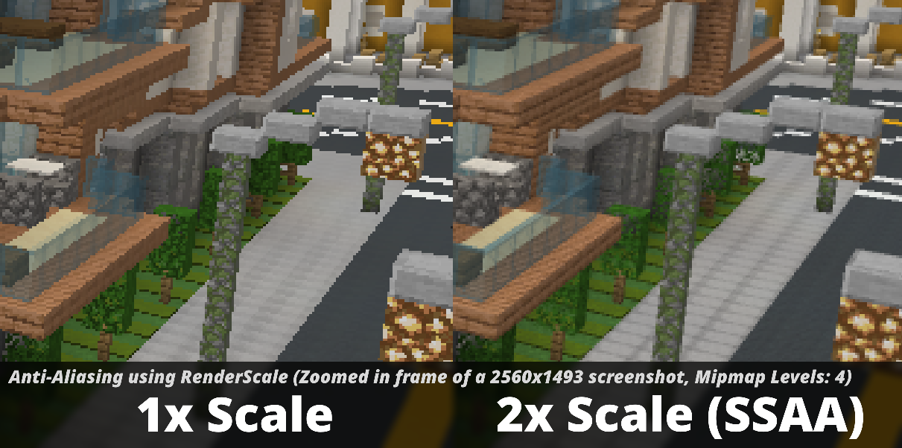

# RenderScale

RenderScale allows you to change Minecraft's render resolution **separately** from the HUD elements.

This is a fork of [ResolutionControl++](https://github.com/ModLabsCC/Resolution-Control), with added support for NeoForge.

Check out [Fabrishot](https://modrinth.com/mod/fabrishot) if you also want the large screenshot feature that was in ResolutionControl.

---

# How

Press `O` or, use the mod menu config to control the render scale multiplier. You can increase for better antialiasing, or decrease for improved performance. This is heavily recommended for laptops with retina displays!

You can also force "linear" scale algorithm (similar to FXAA) in lower render scales if you want. It's best to leave it as OFF if you're using shaders since they usually have their own antialiasing.

There are no plans to support DLSS or FSR 2.0+. I'm looking into potential FSR 1.0 support, but I'm not sure yet.

There are plans for Dynamic Resolution!

---

# Compatibility

Aims to be compatible with any mod, including Sodium, Iris, etc. You can report any issues [here](https://github.com/Zolo101/RenderScale/issues), or on my [discord](https://discord.com/invite/YVuuF9KB5j). Make sure to include your MC logs!

**1.21.5 Note**: There may be some issues using Distant Horizons with shaders. Check out [📌 1.21.5 Distant Horizons with Shaders Infomation](https://github.com/Zolo101/RenderScale/issues/26) for potential fixes.

---

# Supported Versions

| Minecraft       | Fabric | NeoForge | Forge |
|-----------------|--------|----------|-------|
| 1.21.5          | ✅      | ✅        | 🚫    |
| 1.21.4          | ✅      | ✅        | 🚫    |
| 1.21.2 - 1.21.3 | 🚫 [1] | 🚫       | 🚫    |
| 1.21.0 - 1.21.1 | ✅ [3]  | ✅ [3]    | 🚫    |
| 1.20.4 - 1.20.6 | 🚫 [1] | 🚫       | 🚫    |
| 1.20.2 - 1.20.4 | 🚫 [2] | 🚫       | 🚫    |
| 1.20.1          | 🚫 [2] | 🚫       | ✅     |

[1] Available on [ResolutionControl++](https://modrinth.com/mod/resolution-control-plus-plus)

[2] Available on [ResolutionControl+](https://modrinth.com/mod/resolution-control-plus)

[3] Currently does not support Fabulous graphics